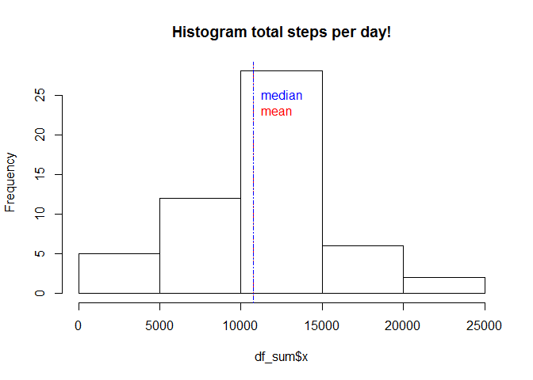
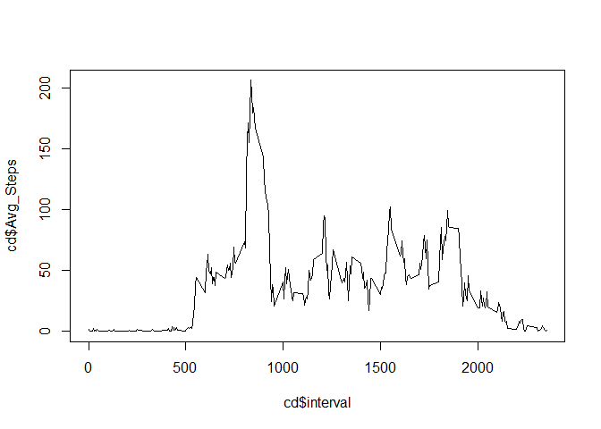
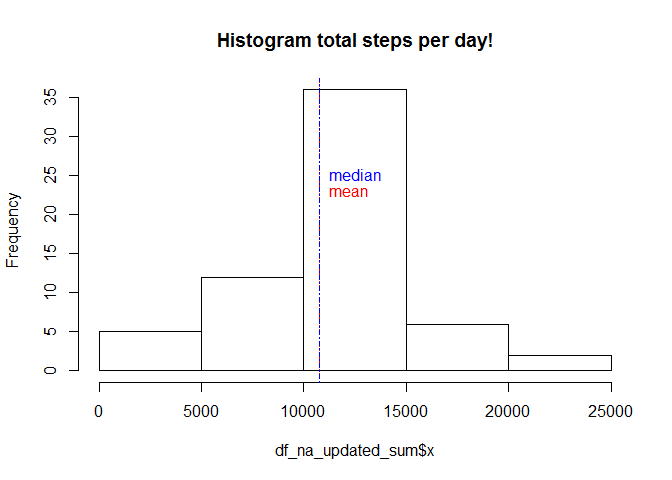
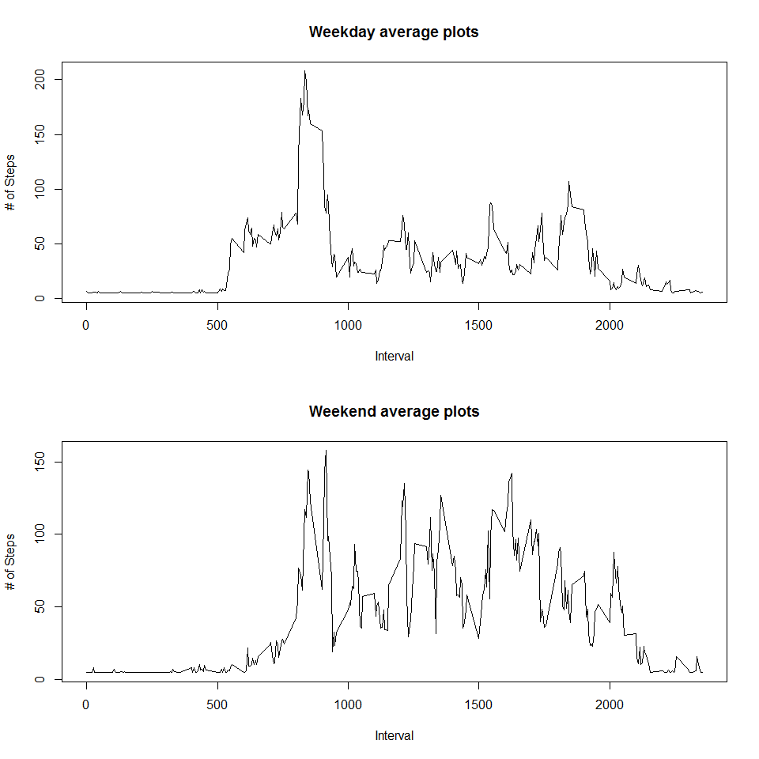

# Reproducible Research: Peer Assessment 1


## Loading and preprocessing the data

```r
df <- read.csv("activity.csv")
```


## What is mean total number of steps taken per day?

```r
df_sum <- aggregate(df$steps, by=list(Date=df$date), FUN=sum)
mean(df_sum$x, na.rm = T)
```

```
## [1] 10766.19
```

```r
median(df_sum$x, na.rm = T)
```

```
## [1] 10765
```

```r
hist(df_sum$x, main = "Histogram total steps per day!")
abline(v=mean(df_sum$x, na.rm = T), lty = 3, col = "red")
text(mean(df_sum$x, na.rm = T),23,labels="mean", pos=4, col="red")
##Median
abline(v=median(df_sum$x, na.rm = T), lty = 4, col = "blue")
text(median(df_sum$x, na.rm = T),25,labels="median", pos=4, col="blue")
```

 


## What is the average daily activity pattern?

```r
library(plyr)
```

```
## Warning: package 'plyr' was built under R version 3.2.2
```

```r
cd <- ddply(df, c("interval"), summarize, Avg_Steps = mean(steps, na.rm = T))
#df_new <- aggregate(cd$Avg_Steps, by=list(Date=cd$date), FUN=mean)
#Interval containing maximum steps

cd[cd$Avg_Steps == max(cd$Avg_Steps), ]
```

```
##     interval Avg_Steps
## 104      835  206.1698
```

```r
plot(cd$interval, cd$Avg_Steps, type = "l")
```

 


## Imputing missing values
Policy for filling in NA's for steps - replace NA values with average across all days

```r
#Total number of missing values or NA values 
nrow(df[is.na(df$steps),])
```

```
## [1] 2304
```

```r
#Policy for filling in NA's - replace NA values with average across all days
#Average num of steps across all days and intervals is 
avg_all <- mean(df$steps, na.rm = T)
df_na_updated <- df
#Replace all NA's with average
df_na_updated$steps[is.na(df_na_updated$steps)] <- avg_all

#TOtal number of steps..

df_na_updated_sum <- aggregate(df_na_updated$steps, by=list(Date=df_na_updated$date), FUN=sum)
mean(df_na_updated_sum$x, na.rm = T)
```

```
## [1] 10766.19
```

```r
median(df_na_updated_sum$x, na.rm = T)
```

```
## [1] 10766.19
```

```r
hist(df_na_updated_sum$x, main = "Histogram total steps per day!")
abline(v=mean(df_na_updated_sum$x, na.rm = T), lty = 3, col = "red")
text(mean(df_na_updated_sum$x, na.rm = T),23,labels="mean", pos=4, col="red")
##Median
abline(v=median(df_na_updated_sum$x, na.rm = T), lty = 4, col = "blue")
text(median(df_na_updated_sum$x, na.rm = T),25,labels="median", pos=4, col="blue")
```

 

```r
#Mean and median are same after filling in average values for NA equal average 
#of all readings!!! They can be rounded off actually! 
#There's NO impact on the mean and that's expected and the median too
# converged to the mean which is not surprising given that we have added
# more entries towards the mean for all NA values
```

Mean and median are same after filling in average values for NA equal average 
of all readings!!! They can be rounded off actually! 
There's NO impact on the mean and that's expected and the median too converged to the mean which is not surprising given that we have added more entries towards the mean for all NA values.


## Are there differences in activity patterns between weekdays and weekends?


```r
new_data <-df_na_updated
new_data$date <- as.Date(strptime(new_data$date, format= "%Y-%m-%d"))
new_data$day <- weekdays(new_data$date)

for (i in 1:nrow(new_data)) {
        if (new_data[i,]$day %in% c("Saturday", "Sunday")) {
                new_data[i,]$day <- "weekend"
        } else {
                new_data[i,]$day <- "weekday"
        }
}
new_data$day <- factor(new_data$day)

new_data_weekday <- new_data[new_data$day == "weekday",]
new_data_weekend <- new_data[new_data$day == "weekend",]


new_data_weekday_mean <- ddply(new_data_weekday,c("interval"), summarize, Avg_Steps = mean(steps, na.rm = T))

new_data_weekend_mean <- ddply(new_data_weekend,c("interval"), summarize, Avg_Steps = mean(steps, na.rm = T))

par(mfrow= c(2,1))
plot(new_data_weekday_mean$interval, new_data_weekday_mean$Avg_Steps, type='l', xlab = "Interval", ylab = "# of Steps", main = "Weekday average plots")
plot(new_data_weekend_mean$interval, new_data_weekend_mean$Avg_Steps, type='l', xlab = "Interval", ylab = "# of Steps", main = "Weekend average plots")
```

 
